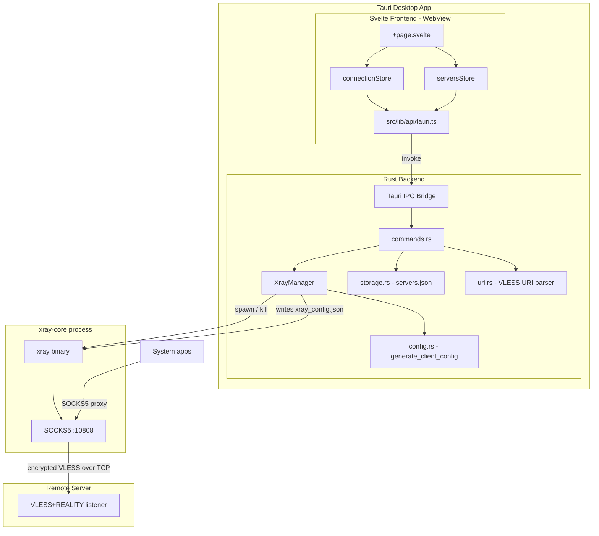
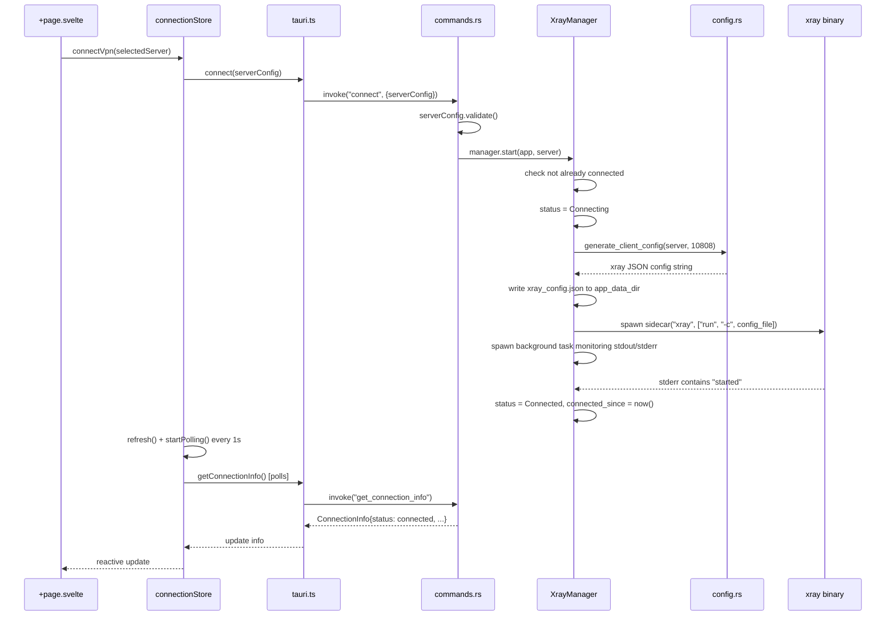
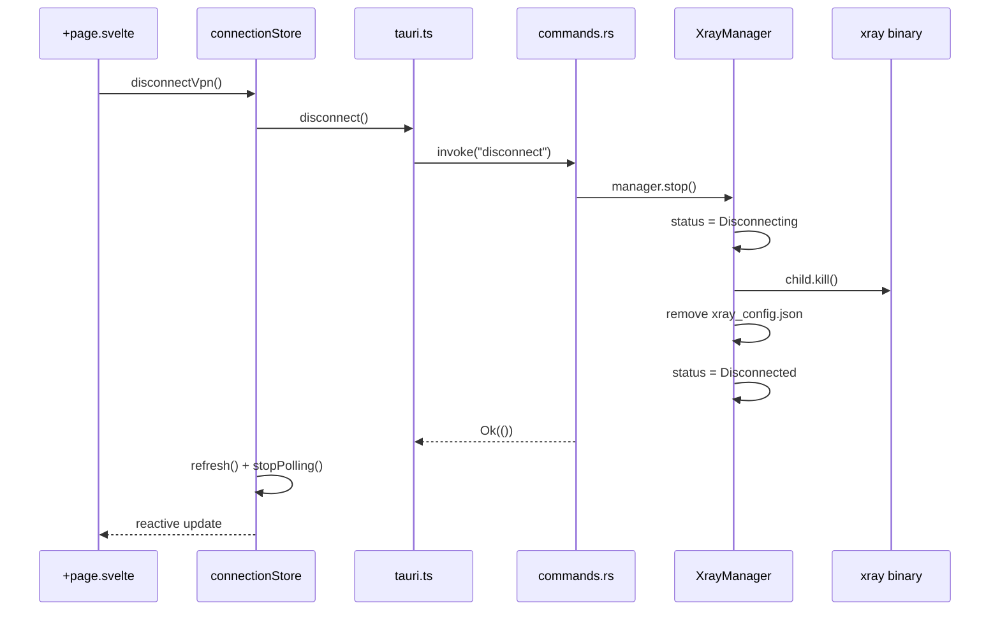

# RustVPN — Architecture

## System Overview

RustVPN is a desktop VPN client that manages xray-core as a child process (sidecar). The Svelte frontend communicates with the Rust backend exclusively through Tauri's IPC bridge. The Rust backend spawns xray-core as a sidecar binary, which handles the actual tunnel to the remote VDS (Virtual Dedicated Server).



## Module Structure

### Rust Backend (`src-tauri/src/`)

| File | Responsibility |
|------|---------------|
| `main.rs` | Entry point; calls `rustvpn_lib::run()` |
| `lib.rs` | Tauri builder setup: registers plugins, manages `XrayManager` state, registers all IPC commands |
| `models.rs` | Core data types: `ServerConfig`, `RealitySettings`, `ConnectionInfo`, `ConnectionStatus`, `AppError` |
| `commands.rs` | All `#[tauri::command]` handlers for connection and server CRUD |
| `xray.rs` | `XrayManager` struct — spawns/kills xray sidecar, monitors output, tracks connection state |
| `config.rs` | `generate_client_config()` — builds the xray JSON config from a `ServerConfig` |
| `network.rs` | `detect_vpn_routes()` — detects corporate VPN interfaces and subnets via `ip -j route show`; `collect_bypass_subnets()` flattens results for proxy/config consumption |
| `storage.rs` | Reads/writes `servers.json` in the OS app config directory |
| `uri.rs` | `parse_vless_uri()` and `to_vless_uri()` — VLESS URI serialization; also exposes `parse_vless_uri_cmd` and `export_vless_uri` as Tauri commands |

### Svelte Frontend (`src/`)

| Path | Responsibility |
|------|---------------|
| `src/routes/+layout.ts` | Sets `prerender = true`, `ssr = false` (static SPA) |
| `src/routes/+layout.svelte` | Root layout; injects CSS and favicon |
| `src/routes/+page.svelte` | Main page; orchestrates all stores and components |
| `src/lib/api/tauri.ts` | Thin wrappers around `invoke()` for every Tauri command |
| `src/lib/types/index.ts` | TypeScript interfaces mirroring Rust structs |
| `src/lib/stores/connection.svelte.ts` | Svelte 5 rune-based store for connection state and actions |
| `src/lib/stores/servers.svelte.ts` | Svelte 5 rune-based store for server list and selection |
| `src/lib/components/ConnectButton.svelte` | Circular toggle button; reflects connection status via color |
| `src/lib/components/StatusDisplay.svelte` | Status indicator dot, connection timer, server info panel |
| `src/lib/components/ServerList.svelte` | Scrollable list of servers with selection, edit, delete |
| `src/lib/components/ServerForm.svelte` | Modal form for adding/editing a server manually |
| `src/lib/components/ImportExportBar.svelte` | Toolbar with Import/Export dropdowns (file + URI) |
| `src/lib/components/UriInputModal.svelte` | Modal text area for pasting a vless:// URI |
| `src/lib/utils/index.ts` | `cn()` helper — `clsx` + `tailwind-merge` |

## Data Flow: Connect/Disconnect Cycle

### Connect



### Disconnect



## IPC Contract

All commands are registered in `src-tauri/src/lib.rs` via `tauri::generate_handler!`. The frontend calls them through `src/lib/api/tauri.ts`.

### Connection Commands

| Command name | Rust handler | Parameters | Return type |
|---|---|---|---|
| `connect` | `commands::connect` | `server_config: ServerConfig` | `Result<(), String>` |
| `disconnect` | `commands::disconnect` | _(none)_ | `Result<(), String>` |
| `get_status` | `commands::get_status` | _(none)_ | `Result<ConnectionStatus, String>` |
| `get_connection_info` | `commands::get_connection_info` | _(none)_ | `Result<ConnectionInfo, String>` |
| `test_connection` | `commands::test_connection` | _(none)_ | `Result<bool, String>` |
| `get_socks_port` | `commands::get_socks_port` | _(none)_ | `Result<u16, String>` |
| `validate_config` | `commands::validate_config` | `server_config: ServerConfig` | `Result<(), String>` |
| `detect_vpn_interfaces` | `commands::detect_vpn_interfaces` | _(none)_ | `Result<Vec<DetectedVpn>, String>` |

### Server CRUD Commands

| Command name | Rust handler | Parameters | Return type |
|---|---|---|---|
| `get_servers` | `commands::get_servers` | _(none)_ | `Result<Vec<ServerConfig>, String>` |
| `add_server` | `commands::add_server` | `server_config: ServerConfig` | `Result<ServerConfig, String>` |
| `update_server` | `commands::update_server` | `server_config: ServerConfig` | `Result<(), String>` |
| `delete_server` | `commands::delete_server` | `id: String` | `Result<(), String>` |

### Import/Export Commands

| Command name | Rust handler | Parameters | Return type |
|---|---|---|---|
| `export_servers` | `commands::export_servers` | _(none)_ | `Result<String, String>` (pretty JSON) |
| `import_servers` | `commands::import_servers` | `json: String` | `Result<Vec<ServerConfig>, String>` |
| `parse_vless_uri_cmd` | `uri::parse_vless_uri_cmd` | `uri: String` | `Result<ServerConfig, String>` |
| `export_vless_uri` | `uri::export_vless_uri` | `server_config: ServerConfig` | `Result<String, String>` |

## State Management

### Rust: `XrayManager` (`src-tauri/src/xray.rs`)

`XrayManager` is a Tauri managed state singleton (`Arc<Mutex<...>>` fields):

| Field | Type | Purpose |
|-------|------|---------|
| `child` | `Arc<Mutex<Option<CommandChild>>>` | Handle to the running xray process |
| `state` | `Arc<Mutex<ConnectionInfo>>` | Current connection status and metadata |
| `config_path` | `Arc<Mutex<Option<PathBuf>>>` | Path to the temp xray config file for cleanup |
| `detected_vpns` | `Arc<Mutex<Vec<DetectedVpn>>>` | Last detected corporate VPN interfaces and subnets |
| `bypass_subnets` | `Arc<Mutex<Vec<String>>>` | Flattened bypass subnets from VPN detection |

State transitions:

```
Disconnected → Connecting → Connected
Connected    → Disconnecting → Disconnected
(xray crash) → Error
```

A background async task (spawned via `tauri::async_runtime::spawn`) monitors xray's stderr. When it detects the word "started", it transitions state from `Connecting` to `Connected`. If xray exits unexpectedly and state is not `Disconnecting`, it sets state to `Error`.

### Svelte: `connectionStore` (`src/lib/stores/connection.svelte.ts`)

Built with Svelte 5 runes (`$state`, `$derived`). Polls `get_connection_info` every 1 second while connected.

| Property | Type | Description |
|----------|------|-------------|
| `info` | `ConnectionInfo` | Full connection info from backend |
| `isLoading` | `boolean` | True during connect/disconnect IPC calls |
| `isConnected` | `boolean` (derived) | `info.status === 'connected'` |
| `isTransitioning` | `boolean` (derived) | `connecting` or `disconnecting` |

Methods: `connectVpn(config)`, `disconnectVpn()`, `refresh()`, `startPolling()`, `stopPolling()`.

### Svelte: `serversStore` (`src/lib/stores/servers.svelte.ts`)

| Property | Type | Description |
|----------|------|-------------|
| `servers` | `ServerConfig[]` | Full list from backend storage |
| `selectedId` | `string \| null` | ID of the selected server |
| `selectedServer` | `ServerConfig \| null` (derived) | The selected server object |
| `selectedIndex` | `number` (derived) | Index of selected server |

Methods: `load()`, `addServer()`, `updateServer()`, `deleteServer()`, `selectServer(id)`, `selectServerByIndex(index)`, `importFromJson(json)`, `importFromUri(uri)`, `exportToJson()`, `exportToUri(server)`.
