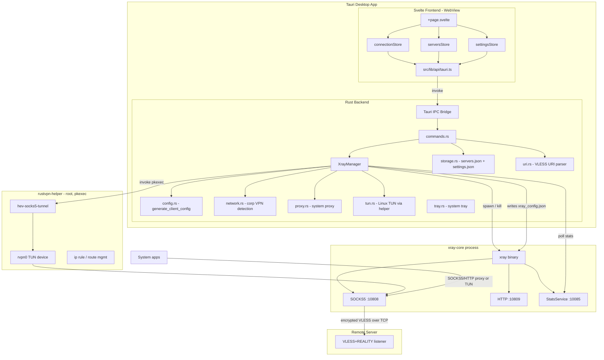
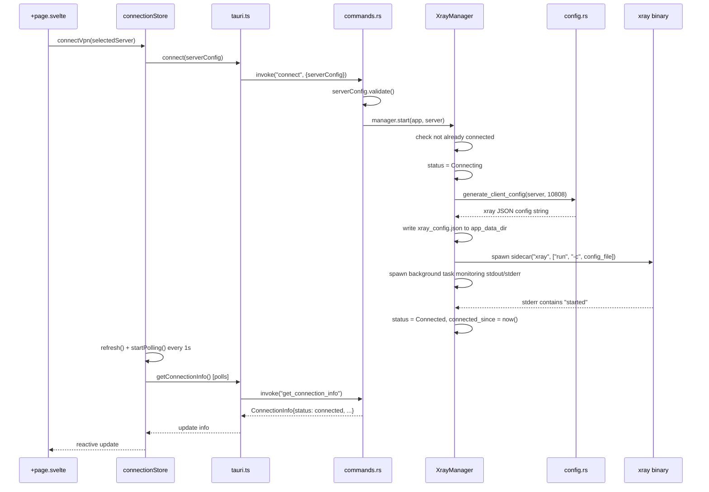
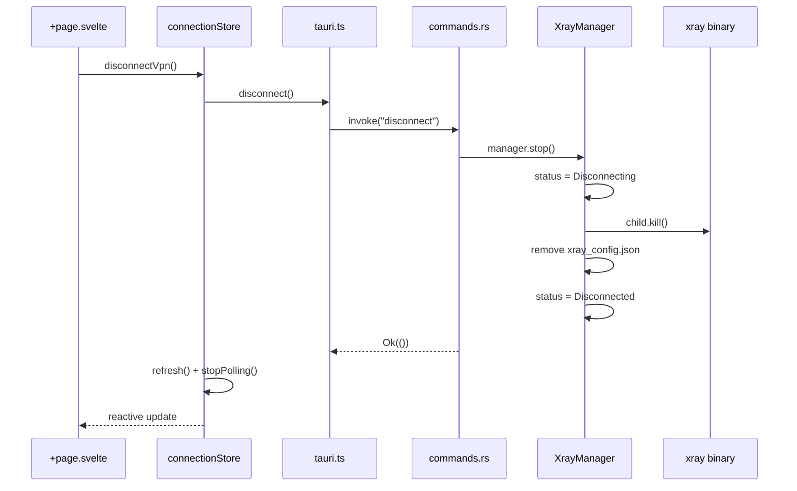

# RustVPN — Architecture

## System Overview

RustVPN is a cross-platform VPN client that manages xray-core as a child process (sidecar). The Svelte frontend communicates with the Rust backend exclusively through Tauri's IPC bridge. The backend can route system traffic in two modes:

- **Proxy mode** (default; all desktop OSes): xray exposes local SOCKS5 + HTTP listeners and `proxy.rs` enables a system-wide proxy via `gsettings` (Linux), the registry (Windows), or `networksetup` (macOS).
- **TUN mode** (Linux): a dedicated `rustvpn-helper` (invoked via `pkexec`) creates a TUN interface and runs hev-socks5-tunnel to convert TUN packets into SOCKS5 traffic. Required for full system VPN behaviour when the system proxy alone is insufficient.

On Android, a custom `tauri-plugin-vpn` runs xray inside an Android `VpnService` with hev-socks5-tunnel attached to the OS-provided TUN file descriptor (see [Android Architecture](#android-architecture) below).


```mermaid
graph TD
    subgraph Desktop App [Tauri Desktop App]
        subgraph Frontend [Svelte Frontend - WebView]
            UI[+page.svelte]
            CS[connectionStore]
            SS[serversStore]
            ST[settingsStore]
            API[src/lib/api/tauri.ts]
            UI --> CS
            UI --> SS
            UI --> ST
            CS --> API
            SS --> API
            ST --> API
        end
        subgraph Backend [Rust Backend]
            IPC[Tauri IPC Bridge]
            CMD[commands.rs]
            XM[XrayManager]
            CFG[config.rs - generate_client_config]
            STG[storage.rs - servers.json + settings.json]
            URI[uri.rs - VLESS URI parser]
            NET[network.rs - corp VPN detection]
            PRX[proxy.rs - system proxy]
            TUN[tun.rs - Linux TUN via helper]
            TRY[tray.rs - system tray]
            CMD --> XM
            CMD --> STG
            CMD --> URI
            XM --> CFG
            XM --> NET
            XM --> PRX
            XM --> TUN
        end
        API -->|invoke| IPC
        IPC --> CMD
    end

    subgraph Sidecar [xray-core process]
        XRAY[xray binary]
        SOCKS[SOCKS5 :10808]
        HTTP[HTTP :10809]
        STATS[StatsService :10085]
        XRAY --> SOCKS
        XRAY --> HTTP
        XRAY --> STATS
    end

    subgraph Helper [rustvpn-helper - root, pkexec]
        HEV[hev-socks5-tunnel]
        TUNDEV[rvpn0 TUN device]
        IPRULE[ip rule / route mgmt]
    end

    subgraph VDS [Remote Server]
        VLESS[VLESS+REALITY listener]
    end

    XM -->|spawn / kill| XRAY
    XM -->|writes xray_config.json| XRAY
    XM -->|invoke pkexec| HEV
    HEV --> TUNDEV
    TUNDEV --> SOCKS
    SOCKS -->|encrypted VLESS over TCP| VLESS
    App[System apps] -->|SOCKS5/HTTP proxy or TUN| SOCKS
    XM -->|poll stats| STATS
```

## Android Architecture

On Android, the desktop sidecar approach is replaced by a VPN service with TUN-based packet routing.

```
User Apps
    ↓ (all traffic intercepted by Android VPN API)
┌──────────────────────────────┐
│  TUN Device (10.0.0.2/30)   │  ← created by RustVpnService via VpnService.Builder
└──────────────────────────────┘
    ↓ (raw IP packets via file descriptor)
┌──────────────────────────────┐
│  hev-socks5-tunnel (libhev)  │  ← reads TUN FD, converts to SOCKS5
│  Loaded via JNI dlopen       │
└──────────────────────────────┘
    ↓ (SOCKS5 TCP/UDP → 127.0.0.1:10808)
┌──────────────────────────────┐
│  xray-core (libxray)         │  ← SOCKS5 inbound → VLESS+REALITY outbound
│  Launched via Runtime.exec() │
└──────────────────────────────┘
    ↓ (encrypted VLESS over TCP)
┌──────────────────────────────┐
│  VPN Server (VDS)            │
└──────────────────────────────┘
```

### Key Android Components

| File | Responsibility |
|------|---------------|
| `tauri-plugin-vpn/android/.../RustVpnService.kt` | Android `VpnService` — creates TUN, launches xray and hev, manages lifecycle |
| `tauri-plugin-vpn/android/.../VpnPlugin.kt` | Tauri plugin bridge — handles VPN permission, starts/stops service, queries stats |
| `tauri-plugin-vpn/android/.../HevTunnel.kt` | Kotlin JNI wrapper — loads libhev.so via dlopen, runs tunnel in pthread |
| `tauri-plugin-vpn/android/.../cpp/hev_jni.c` | C JNI library — dlopen/dlsym wrapper for hev-socks5-tunnel shared library |
| `tauri-plugin-vpn/src/mobile.rs` | Rust plugin interface for Android (calls Kotlin via Tauri mobile plugin API) |
| `src-tauri/src/config.rs` | `modify_config_for_android()` — adds `sockopt.mark`, removes HTTP inbound |

### Why JNI dlopen (not fork/exec)?

The pre-built `hev-socks5-tunnel` binary from GitHub releases is a Linux/glibc executable that **cannot run on Android** (which uses bionic libc). The previous fork/exec approach silently failed with exit code 127. Instead, hev-socks5-tunnel is compiled from source using NDK to produce an Android shared library (`libhev.so`). The JNI wrapper (`libhevjni.so`) loads it at runtime via `dlopen()`, resolves the `hev_socks5_tunnel_main_from_file` and `hev_socks5_tunnel_quit` symbols, and runs the tunnel in a pthread. The TUN file descriptor is passed via the hev YAML config `fd:` parameter.

### Routing Loop Prevention

`addRoute("0.0.0.0", 0)` routes all traffic through the TUN, including xray's own connection to the VPN server. On Android, `sockopt.mark` does **not** bypass VPN routing (unlike Linux iptables). Instead, `addDisallowedApplication(packageName)` excludes the app's UID from VPN routing. Since xray and hev run as child processes with the same UID, their network traffic bypasses the TUN. hev still reads the TUN FD directly (file descriptor access, not network routing), so it is unaffected.

### Android Binary Dependencies

| Binary | Config name | Source | Purpose |
|--------|-----------|--------|---------|
| `libxray.so` | xray-core | [XTLS/Xray-core releases](https://github.com/XTLS/Xray-core/releases) | VLESS+REALITY proxy engine |
| `libhev.so` | hev-socks5-tunnel | Built from source via NDK ([heiher/hev-socks5-tunnel](https://github.com/heiher/hev-socks5-tunnel)) | TUN → SOCKS5 packet converter |
| `libhevjni.so` | — | Compiled from `cpp/hev_jni.c` via NDK/CMake | JNI dlopen wrapper for libhev.so |

Binaries are placed in `tauri-plugin-vpn/android/src/main/jniLibs/arm64-v8a/` (xray, hev) and compiled automatically (hevjni).

## Module Structure

### Rust Backend (`src-tauri/src/`)

| File | Responsibility |
|------|---------------|
| `main.rs` | Entry point; calls `rustvpn_lib::run()` |
| `lib.rs` | Tauri builder setup: registers plugins, manages `XrayManager` state, hooks startup recovery (stale TUN cleanup, system-proxy reset, auto-connect, Android `adopt_running_state`), registers all IPC commands |
| `models.rs` | Core data types: `ServerConfig`, `RealitySettings`, `ConnectionInfo`, `ConnectionStatus`, `SpeedStats`, `LogEntry`, `AppSettings`, `DetectedVpn`, `AppError` |
| `commands.rs` | All `#[tauri::command]` handlers — connection, server CRUD, import/export, settings, logs, speed stats, bypass-domain reload, battery-optimization helpers, VPN detection |
| `xray.rs` | `XrayManager` struct — spawns/kills xray sidecar, polls StatsService, buffers logs, drives system proxy + TUN startup, emits `connection-status-changed` events |
| `config.rs` | `generate_client_config()` builds the xray JSON config (proxy or TUN flavour); `modify_config_for_android()` post-processes for the mobile build |
| `network.rs` | `detect_vpn_routes()` — detects corporate VPN interfaces/subnets via `ip -j route show`; `collect_bypass_subnets()` flattens results; `detect_default_gateway_and_ip()` for TUN setup; corporate-VPN DNS scrape from `/etc/resolv.conf` |
| `proxy.rs` _(desktop)_ | `enable_system_proxy()` / `disable_system_proxy()` / `reset_stale_system_proxy()` — Linux (`gsettings`), Windows (registry), macOS (`networksetup`) |
| `tun.rs` _(Linux)_ | `start_tun()` / `stop_tun()` / `cleanup_stale_tun()` — talks to `rustvpn-helper` via `pkexec` to create the `rvpn0` TUN device, run `hev-socks5-tunnel`, and add `ip rule` / `ip route` entries |
| `tray.rs` _(desktop)_ | System tray menu (Show / Connect / Quit), updates the toggle label by listening for `connection-status-changed` |
| `storage.rs` | Reads/writes `servers.json` and `settings.json` in the OS app config directory |
| `uri.rs` | `parse_vless_uri()` and `to_vless_uri()` — VLESS URI serialization; also exposes `parse_vless_uri_cmd` and `export_vless_uri` as Tauri commands |

### Svelte Frontend (`src/`)

| Path | Responsibility |
|------|---------------|
| `src/routes/+layout.ts` | Sets `prerender = true`, `ssr = false` (static SPA) |
| `src/routes/+layout.svelte` | Root layout; injects CSS and favicon |
| `src/routes/+page.svelte` | Main page; orchestrates all stores and components |
| `src/routes/logs/+page.svelte` | Live log viewer route (paired with `LogViewer` component) |
| `src/lib/api/tauri.ts` | Thin wrappers around `invoke()` for every Tauri command |
| `src/lib/types/index.ts` | TypeScript interfaces mirroring Rust structs |
| `src/lib/stores/connection.svelte.ts` | Svelte 5 rune store for connection state, polling, speed-stat updates |
| `src/lib/stores/servers.svelte.ts` | Svelte 5 rune store for server list and selection |
| `src/lib/stores/settings.svelte.ts` | Svelte 5 rune store for `AppSettings` (auto-connect, bypass domains) with rollback on save failure |
| `src/lib/components/ConnectButton.svelte` | Circular toggle button; reflects connection status via color |
| `src/lib/components/StatusDisplay.svelte` | Status indicator dot, connection timer, server info panel |
| `src/lib/components/ServerList.svelte` | Scrollable list of servers with selection, edit, delete |
| `src/lib/components/ServerForm.svelte` | Modal form for adding/editing a server manually |
| `src/lib/components/ImportExportBar.svelte` | Toolbar with Import/Export dropdowns (file + URI) |
| `src/lib/components/UriInputModal.svelte` | Modal text area for pasting a vless:// URI |
| `src/lib/components/SpeedGraph.svelte` | Sparkline of upload/download speed driven by `get_speed_stats` polling |
| `src/lib/components/LogViewer.svelte` | Tail of xray logs from the in-memory buffer |
| `src/lib/components/BackgroundModeModal.svelte` | Mobile prompt to grant battery-optimization exemption / open OEM auto-launch settings |
| `src/lib/components/ThemeToggle.svelte` | Light/dark toggle |
| `src/lib/components/ui/` | shadcn-svelte primitives (button, dialog, input, ...) |
| `src/lib/utils/index.ts` | `cn()` helper — `clsx` + `tailwind-merge` |

## Data Flow: Connect/Disconnect Cycle

### Connect


```mermaid
sequenceDiagram
    participant UI as +page.svelte
    participant CS as connectionStore
    participant API as tauri.ts
    participant Rust as commands.rs
    participant XM as XrayManager
    participant CFG as config.rs
    participant XRAY as xray binary

    UI->>CS: connectVpn(selectedServer)
    CS->>API: connect(serverConfig)
    API->>Rust: invoke("connect", {serverConfig})
    Rust->>Rust: serverConfig.validate()
    Rust->>XM: manager.start(app, server)
    XM->>XM: check not already connected
    XM->>XM: status = Connecting
    XM->>CFG: generate_client_config(server, 10808)
    CFG-->>XM: xray JSON config string
    XM->>XM: write xray_config.json to app_data_dir
    XM->>XRAY: spawn sidecar("xray", ["run", "-c", config_file])
    XM->>XM: spawn background task monitoring stdout/stderr
    XRAY-->>XM: stderr contains "started"
    XM->>XM: status = Connected, connected_since = now()
    CS->>CS: refresh() + startPolling() every 1s
    CS->>API: getConnectionInfo() [polls]
    API->>Rust: invoke("get_connection_info")
    Rust-->>API: ConnectionInfo{status: connected, ...}
    API-->>CS: update info
    CS-->>UI: reactive update
```

### Disconnect


```mermaid
sequenceDiagram
    participant UI as +page.svelte
    participant CS as connectionStore
    participant API as tauri.ts
    participant Rust as commands.rs
    participant XM as XrayManager
    participant XRAY as xray binary

    UI->>CS: disconnectVpn()
    CS->>API: disconnect()
    API->>Rust: invoke("disconnect")
    Rust->>XM: manager.stop()
    XM->>XM: status = Disconnecting
    XM->>XRAY: child.kill()
    XM->>XM: remove xray_config.json
    XM->>XM: status = Disconnected
    Rust-->>API: Ok(())
    CS->>CS: refresh() + stopPolling()
    CS-->>UI: reactive update
```

## IPC Contract

All commands are registered in `src-tauri/src/lib.rs` via `tauri::generate_handler!`. The frontend calls them through `src/lib/api/tauri.ts`.

### Connection Commands

| Command name | Rust handler | Parameters | Return type |
|---|---|---|---|
| `connect` | `commands::connect` | `server_config: ServerConfig` | `Result<(), String>` |
| `disconnect` | `commands::disconnect` | _(none)_ | `Result<(), String>` |
| `get_status` | `commands::get_status` | _(none)_ | `Result<ConnectionStatus, String>` |
| `get_connection_info` | `commands::get_connection_info` | _(none)_ | `Result<ConnectionInfo, String>` |
| `test_connection` | `commands::test_connection` | _(none)_ | `Result<bool, String>` |
| `get_socks_port` | `commands::get_socks_port` | _(none)_ | `Result<u16, String>` |
| `validate_config` | `commands::validate_config` | `server_config: ServerConfig` | `Result<(), String>` |
| `detect_vpn_interfaces` | `commands::detect_vpn_interfaces` | _(none)_ | `Result<Vec<DetectedVpn>, String>` |
| `get_speed_stats` | `commands::get_speed_stats` | _(none)_ | `Result<SpeedStats, String>` |

### Server CRUD Commands

| Command name | Rust handler | Parameters | Return type |
|---|---|---|---|
| `get_servers` | `commands::get_servers` | _(none)_ | `Result<Vec<ServerConfig>, String>` |
| `add_server` | `commands::add_server` | `server_config: ServerConfig` | `Result<ServerConfig, String>` |
| `update_server` | `commands::update_server` | `server_config: ServerConfig` | `Result<(), String>` |
| `delete_server` | `commands::delete_server` | `id: String` | `Result<(), String>` |

### Import/Export Commands

| Command name | Rust handler | Parameters | Return type |
|---|---|---|---|
| `export_servers` | `commands::export_servers` | _(none)_ | `Result<String, String>` (pretty JSON) |
| `import_servers` | `commands::import_servers` | `json: String` | `Result<Vec<ServerConfig>, String>` |
| `parse_vless_uri_cmd` | `uri::parse_vless_uri_cmd` | `uri: String` | `Result<ServerConfig, String>` |
| `export_vless_uri` | `uri::export_vless_uri` | `server_config: ServerConfig` | `Result<String, String>` |

### Settings & Logs

| Command name | Rust handler | Parameters | Return type |
|---|---|---|---|
| `get_settings` | `commands::get_settings` | _(none)_ | `Result<AppSettings, String>` |
| `update_settings` | `commands::update_settings` | `settings: AppSettings` | `Result<(), String>` |
| `apply_bypass_domains` | `commands::apply_bypass_domains` | `domains: Vec<String>` | `Result<bool, String>` (true if a live session was reloaded) |
| `get_logs` | `commands::get_logs` | _(none)_ | `Result<Vec<LogEntry>, String>` |
| `clear_logs` | `commands::clear_logs` | _(none)_ | `Result<(), String>` |

### Mobile Background-Mode Commands

These exist on every platform but are no-ops on desktop (Doze and OEM auto-launch policies are mobile-only).

| Command name | Rust handler | Parameters | Return type |
|---|---|---|---|
| `is_battery_optimization_ignored` | `commands::is_battery_optimization_ignored` | _(none)_ | `Result<bool, String>` |
| `request_ignore_battery_optimization` | `commands::request_ignore_battery_optimization` | _(none)_ | `Result<bool, String>` |
| `open_oem_background_settings` | `commands::open_oem_background_settings` | _(none)_ | `Result<OemSettingsResult, String>` |

## State Management

### Rust: `XrayManager` (`src-tauri/src/xray.rs`)

`XrayManager` is a Tauri managed state singleton. All fields are `Arc<Mutex<...>>` so they can be read from any IPC handler. Several fields are gated to a single platform — the table notes which.

| Field | Platform | Purpose |
|-------|----------|---------|
| `child` | desktop | Handle to the running xray sidecar (`CommandChild`) |
| `state` | all | Current `ConnectionInfo` (status, server name/address, connected_since, error) |
| `config_path` | desktop | Path to the temp xray config for cleanup |
| `stats` | all | Last `SpeedStats` snapshot computed from xray's StatsService |
| `prev_uplink` / `prev_downlink` | all | Previous traffic counters used to derive instantaneous speed |
| `logs` | all | Bounded `VecDeque<LogEntry>` (cap `MAX_LOG_ENTRIES = 1000`) populated from xray stdout/stderr |
| `bypass_domains` | desktop | Last applied bypass-domain list (used when `apply_bypass_domains` reloads) |
| `bypass_subnets` | desktop | Flattened bypass subnets from VPN detection |
| `detected_vpns` | all | Last detected corporate VPN interfaces and subnets |

State transitions:

```
Disconnected → Connecting → Connected
Connected    → Disconnecting → Disconnected
(xray crash) → Error
```

A background async task (spawned via `tauri::async_runtime::spawn`) monitors xray's stderr. When it detects the word "started", it transitions state from `Connecting` to `Connected`, emits a `connection-status-changed` event (the tray menu listens for this to flip the label), and starts polling the StatsService. If xray exits unexpectedly and state is not `Disconnecting`, it sets state to `Error` and tears down the system proxy / TUN.

#### Startup and recovery

`lib.rs::run()` performs three recovery steps before the first frame is shown:

1. **Stale TUN cleanup** (Linux only) — `tun::cleanup_stale_tun()` removes a leftover `rvpn0` device and its `ip rule` entries from a previous crash.
2. **System-proxy reset** (desktop) — `proxy::reset_stale_system_proxy()` clears any system-proxy setting still pointing at our local ports, otherwise apps would briefly hit a dead listener while the new session starts.
3. **Auto-connect** — if `AppSettings.auto_connect` is true and a `last_server_id` is saved, the manager calls `start()` for that server. On Android, a still-running `VpnService` from a swiped-away session is adopted via `XrayManager::adopt_running_state()` instead of being restarted.

#### System tray and hide-to-tray

`tray::setup_tray()` registers a tray icon with three menu items: Show Window, a toggle that flips between **Connect** and **Disconnect** in response to `connection-status-changed`, and Quit. The main window's `WindowEvent::CloseRequested` is intercepted in `lib.rs` to call `api.prevent_close()` and `window.hide()` instead — the app keeps running in the tray.

### Svelte: `connectionStore` (`src/lib/stores/connection.svelte.ts`)

Built with Svelte 5 runes (`$state`, `$derived`). Polls `get_connection_info` every 1 second while connected.

| Property | Type | Description |
|----------|------|-------------|
| `info` | `ConnectionInfo` | Full connection info from backend |
| `isLoading` | `boolean` | True during connect/disconnect IPC calls |
| `isConnected` | `boolean` (derived) | `info.status === 'connected'` |
| `isTransitioning` | `boolean` (derived) | `connecting` or `disconnecting` |

Methods: `connectVpn(config)`, `disconnectVpn()`, `refresh()`, `startPolling()`, `stopPolling()`.

### Svelte: `serversStore` (`src/lib/stores/servers.svelte.ts`)

| Property | Type | Description |
|----------|------|-------------|
| `servers` | `ServerConfig[]` | Full list from backend storage |
| `selectedId` | `string \| null` | ID of the selected server |
| `selectedServer` | `ServerConfig \| null` (derived) | The selected server object |
| `selectedIndex` | `number` (derived) | Index of selected server |

Methods: `load()`, `addServer()`, `updateServer()`, `deleteServer()`, `selectServer(id)`, `selectServerByIndex(index)`, `importFromJson(json)`, `importFromUri(uri)`, `exportToJson()`, `exportToUri(server)`.

### Svelte: `settingsStore` (`src/lib/stores/settings.svelte.ts`)

| Property | Type | Description |
|----------|------|-------------|
| `settings` | `AppSettings` | Auto-connect flag, last server ID, bypass domains list |
| `loaded` | `boolean` | Set true once `load()` has run (success or failure) |
| `loadError` / `saveError` | `string \| null` | Surface IPC failures to the UI; on save failure the in-memory state is rolled back to disk |

Methods: `load()`, `setAutoConnect(value)`, `setBypassDomains(domains)`. `setBypassDomains` routes through `apply_bypass_domains`, which restarts the xray/TUN stack if a session is active so the new bypass list takes effect immediately. The store also no-ops when the new list is identical to the current one — a stop/start cycle on every textarea blur would otherwise drop the live VPN.

## Linux TUN Mode

When the user enables TUN mode (or `send_through` is required for routing), `XrayManager::start()` does the following before launching xray:

1. Calls `network::detect_default_gateway_and_ip()` to discover the physical interface and its local IP.
2. Calls `network::detect_vpn_routes()` to harvest corporate-VPN subnets and DNS servers.
3. Generates the xray config with `send_through = Some(local_ip)` so outbounds bind to the physical interface.
4. Starts xray.
5. Calls `tun::start_tun()`, which invokes `rustvpn-helper` via `pkexec` with the gateway, device, local IP, server IP and bypass subnets. The helper runs as root, creates the `rvpn0` TUN device, launches `hev-socks5-tunnel` to convert TUN packets into SOCKS5 traffic against xray's local listener, and configures the kernel routing tables (default route via `rvpn0`, `ip rule from <local_ip> lookup main` to escape the TUN for xray's own outbound, and a `/32` route to the VPN server).

`tun::stop_tun()` reverses everything via the helper. The helper itself watches the app PID and self-destructs if the GUI exits without calling `stop_tun` (defence against orphaned TUN setups).

For TUN mode to work, the helper must be installed once with `sudo ./scripts/install-helper.sh` (places `/usr/local/sbin/rustvpn-helper` and a polkit rule).
